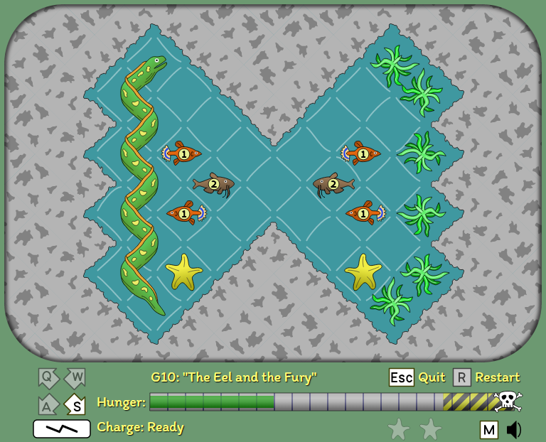

# It's EELectric!

#### A web-based puzzle game

[Play it online](https://sbj42.github.io/its-eelectric/game/)!

Do you like eel-based puzzle games?  Ready for some mind-bending diagonal-moving action?  No?  Nevertheless, let me introduce you to It's EELectric!.

For the kids version, see [It's EELectric! (Junior)](https://github.com/sbj42/its-eelectric-junior).

In this game you star as an apex predator, the deadly _Electrophorus electricus_, better known as the electric eel. This is not a realistic eel simulation. In fact, I looked it up: electric eels don't look like this thing at all.

Plus, I don't think there are starfish in the same... you know what, just swim with it.  Your job is to eat all the fish on the level, but before you chow down on the unsuspecting prey you have to kill it with your electric shock attack.  And you're hungry and getting hungrier, so you'll have to be careful not to waste any moves.  Otherwise you'll perish and have to press R to go back in time to try again.  I already mentioned it's not realistic.  SHOCKING.

Enjoy 37 fiendfishly difficult pools of funderwater puzzling!  With sound sea-ffects!  It's... reel... something.

## Run it locally

~~~
npm install
npm start
~~~
